<!-- Elegant Header with Gradient -->

<!-- Animated Typing Effect -->

 

<!-- Contact Badges with Custom Colors -->

---

## 💼 About Me

Finance professional specializing in **high-volume accounts payable operations** and **financial data management**. Currently pursuing a Master's in Corporate Finance at Universidad de Las Américas Puebla while building automation solutions to eliminate manual financial processes.

   

<table>
<tr>
<td width="50%" valign="middle">

 **Current Role:** Accounts Payable Analyst @ Gordian Staffing  
 **Education:** Master's in Corporate Finance - UDLAP (Jan 2026 - Present)  
 **Core Strength:** 99.9% accuracy across 12,000+ record datasets  

</td>
<td width="50%" valign="middle">

 **Key Impact:** 20% reduction in payment delays | 15% reporting improvement  
 **Technical Focus:** Python automation | SAP FICO | Excel VBA  
 **Languages:** Spanish (Native), English (C2 Professional)

</td>
</tr>
</table>

 

**Mission:** Transforming traditional finance operations through data-driven automation and intelligent workflows.

 

---

## 📊 Impact Metrics

<table>
<tr>
<th width="25%">📈 Metric</th>
<th width="25%">🎯 Achievement</th>
<th width="50%">💡 Business Impact</th>
</tr>
<tr>
<td align="center"><b>Data Accuracy</b></td>
<td align="center"><code>99.9%</code></td>
<td>Flawless processing of 12,000+ financial records</td>
</tr>
<tr>
<td align="center"><b>Payment Processing</b></td>
<td align="center"><code>100%</code></td>
<td>Zero late payments, perfect compliance record</td>
</tr>
<tr>
<td align="center"><b>Reporting Enhancement</b></td>
<td align="center"><code>+15%</code></td>
<td>Improved monthly financial statement accuracy</td>
</tr>
<tr>
<td align="center"><b>Process Efficiency</b></td>
<td align="center"><code>-20%</code></td>
<td>Reduced payment cycle delays through optimization</td>
</tr>
<tr>
<td align="center"><b>Data Management</b></td>
<td align="center"><code>Multi-System</code></td>
<td>Seamless migration & integration across platforms</td>
</tr>
</table>

<!-- Mermaid Impact Visualization -->

---

## 🛠️ Technical Skills

### Finance & Accounting Systems
<table>
<tr>
<td align="center" width="25%">
 
<b>SAP</b> 
FICO Module 

</td>
<td align="center" width="25%">
 
<b>QuickBooks</b> 
AP/AR & Reporting 

</td>
<td align="center" width="25%">
 
<b>Bill.com</b> 
Invoice Processing 

</td>
<td align="center" width="25%">
 
<b>Salesforce</b> 
Finance & CRM 

</td>
</tr>
</table>

### Data Analysis & Productivity
<table>
<tr>
<td align="center" width="33%">
 
<b>Excel</b> 
Power Pivot • Formulas 
⭐⭐⭐⭐⭐
</td>
<td align="center" width="33%">
 
<b>Word</b> 
Documentation 

</td>
<td align="center" width="33%">
 
<b>PowerPoint</b> 
Presentations 
⭐⭐⭐⭐⭐
</td>
</tr>
</table>

### Programming & Automation
<table>
<tr>
<td align="center" width="33%">
 
<b>Python</b> 
Pandas • Automation 

</td>
<td align="center" width="33%">
 
<b>SQL</b> 
Data Queries 

</td>
<td align="center" width="33%">
 
<b>Power BI</b> 
Dashboards & Analytics 

</td>
</tr>
</table>

---

## 💼 Professional Experience

<b>📊 Accounts Payable Analyst</b> • Gordian Staffing <i>(Remote)</i> | <code>March 2025 - Present</code>

 

**Key Achievements:**

- ✅ 99.9% data accuracy across 12,000+ record datasets
- ✅ 100% on-time vendor payment processing
- ✅ 20% reduction in payment delays through vendor documentation management
- ✅ 15% improvement in monthly financial reporting accuracy

**Core Responsibilities:**
- 💰 Process and validate high-volume vendor invoices with perfect payment timeline compliance
- 📊 Execute large-scale data entry operations maintaining 99.9% accuracy standards
- 🔄 Extract, validate, cleanse, and migrate financial data across multiple systems
- 📈 Organize and analyze financial data using Excel pivot tables, advanced formulas, and conditional formatting
- 🔍 Identify and eliminate duplicate entries across multi-thousand-line datasets
- 🤝 Coordinate with vendors to secure missing documentation and resolve discrepancies
- 📋 Support month-end and year-end closings for efficient reporting cycles

**Technical Environment:** `SAP` `QuickBooks` `Bill.com` `Excel Advanced` `Data Migration Tools`

<b>🢠Accounts Payable Specialist</b> • Schaeffler <i>(Hybrid - Huejotzingo, Puebla)</i> | <code>June 2024 - February 2025</code>

 

**Key Achievements:**
- ✅ Processed high-volume vendor invoices with zero compliance violations
- 💳 Maintained perfect bank reconciliation accuracy
- 📊 Contributed to seamless month-end and year-end financial closings

**Core Responsibilities:**
- 💼 Processed vendor invoices using SAP FICO module
- 🔍 Verified invoices against purchase orders and receipts for accuracy
- 📞 Contacted suppliers to resolve discrepancies and ensure timely payments
- ⏰ Scheduled and tracked payments, avoiding late fees
- 🏦 Performed bank reconciliations aligning company records with statements
- 📁 Maintained organized financial documentation for audits and compliance
- 📈 Prepared detailed financial reports supporting closings
- ⚖️ Ensured compliance with U.S. GAAP, accrual accounting, and internal controls
- 🤝 Collaborated with internal departments to optimize AP processes

**Technical Environment:** `SAP FICO` `U.S. GAAP` `Accrual Accounting` `Financial Reporting`

<b>🍽️ Accounting & Administrative Specialist</b> • Corporativo WILD DOG <i>(Hybrid - Puebla)</i> | <code>November 2023 - May 2024</code>

 

**Key Achievements:**
- 📊 Managed complete AP/AR cycle with 100% accuracy
- 💵 Monitored multi-location restaurant cash flow operations
- 🧾 Ensured perfect tax compliance (VAT and payroll filings)

**Core Responsibilities:**
- 💼 Managed accounts payable and receivable using QuickBooks
- 📈 Prepared daily, weekly, and monthly sales and expense reports
- 💰 Monitored cash flow from restaurant operations, reconciling with POS systems
- 📊 Assisted in budget preparation and cost control initiatives
- 📦 Controlled inventory records, coordinating with teams to reduce waste
- ⚖️ Ensured compliance with local tax regulations
- 🔍 Supported audits through organized financial documentation
- 📋 Oversaw administrative tasks including scheduling and internal communications

**Technical Environment:** `QuickBooks` `POS Systems` `Tax Compliance` `Budget Management`

<b>📚 Additional Experience</b>

 

**Accounting & Administrative Intern** • Corporativo WILD DOG | `August 2023 - November 2023`
- Documented administrative and accounting processes
- Updated supplier catalogs and cost databases
- Supported month-end and year-end closing activities
- Assisted in internal and external audits

**Workshop Teacher** • Universidad de Las Américas Puebla - Proyecto Pi ENSA | `March 2023 - November 2023`
- Taught entrepreneurship workshops to primary and secondary students
- Designed activities encouraging creative thinking and leadership
- Guided students in developing business ideas

**Administrative Clerk** • Promoquín | `June 2021 - August 2023`
- Supported sales and logistics department administration
- Prepared quotations, invoices, and orders
- Coordinated deliveries with warehouse and transportation

---

## 🎯 Core Competencies

```mermaid
%%{init: {'theme':'base', 'themeVariables': { 'primaryColor':'#FFE5EC', 'primaryTextColor':'#4A4A4A', 'primaryBorderColor':'#D4A5A5', 'lineColor':'#E6C9D0', 'secondaryColor':'#F5E6F1', 'tertiaryColor':'#FFF5F7', 'background':'#FFFAFC', 'mainBkg':'#FFE5EC', 'secondBkg':'#F5E6F1', 'tertiaryBkg':'#FFF5F7'}}}%%
flowchart TB
    A["💼 Finance & Data Operations"]
    
    A --> B["🏦 Financial Systems"]
    A --> C["📊 Data Management"]
    A --> D["🤖 Process Automation"]
    A --> E["⚖️ Compliance & Controls"]
    A --> F["📈 Analytics & Reporting"]
    
    B --> B1["SAP FICO"]
    B --> B2["QuickBooks"]
    B --> B3["Bill.com"]
    B --> B4["Salesforce"]
    
    C --> C1["Extraction"]
    C --> C2["Validation"]
    C --> C3["Cleansing"]
    C --> C4["Migration"]
    
    D --> D1["Excel VBA"]
    D --> D2["Python Scripts"]
    D --> D3["Workflow Optimization"]
    
    E --> E1["U.S. GAAP"]
    E --> E2["Accrual Accounting"]
    E --> E3["Audit Preparation"]
    E --> E4["Tax Compliance"]
    
    F --> F1["Power Pivot"]
    F --> F2["Advanced Formulas"]
    F --> F3["Dashboards"]
    F --> F4["KPI Tracking"]
    
    classDef primary fill:#FFE5EC,stroke:#D4A5A5,stroke-width:2px,color:#4A4A4A
    classDef secondary fill:#F5E6F1,stroke:#E6C9D0,stroke-width:2px,color:#4A4A4A
    classDef tertiary fill:#FFF5F7,stroke:#E6C9D0,stroke-width:1px,color:#4A4A4A
    
    class A primary
    class B,C,D,E,F secondary
    class B1,B2,B3,B4,C1,C2,C3,C4,D1,D2,D3,E1,E2,E3,E4,F1,F2,F3,F4 tertiary
```

---

## 🚀 Featured Projects

<table>
<tr>
<td width="50%">

### 🔄 AP Data Migration Toolkit

**Problem:** Manual vendor data entry across multiple systems consumes hours and introduces errors

**Solution:** Automated extraction, validation, and migration pipeline

**Tech Stack:**
- Python (pandas, openpyxl)
- Data validation rules
- Error logging system
- Database integration

**Expected Impact:**
- 10+ hours saved monthly
- Elimination of manual entry errors
- Scalable for growing vendor base

</td>
<td width="50%">

### 📊 Invoice Validation Engine

**Problem:** Manual invoice validation before SAP entry is time-intensive and error-prone

**Solution:** Automated pre-processing validation with anomaly detection

**Features:**
- Required field validation
- Amount threshold alerts
- PO matching logic
- Vendor master verification
- Exception reporting

**Expected Impact:**
- Maintain 99.9% accuracy at scale
- Faster processing times
- Proactive error prevention

</td>
</tr>
<tr>
<td width="50%">

### 📈 AP Analytics Dashboard

**Problem:** Lack of real-time visibility into AP metrics and trends

**Solution:** Interactive Power BI dashboard with drill-down capabilities

**KPIs Tracked:**
- Days Payable Outstanding
- Aging analysis by vendor
- Payment cycle metrics
- Exception tracking
- Cash flow forecasting

**Expected Impact:**
- Data-driven decision making
- Proactive vendor management
- Improved cash flow planning

</td>
<td width="50%">

### 🤖 Excel VBA Duplicate Detector

**Problem:** Manual duplicate checking in 12,000+ record datasets is time-prohibitive

**Solution:** One-click VBA macro for duplicate identification

**Detection Logic:**
- Vendor + Invoice number
- Amount + Date matching
- Fuzzy matching option
- Color-coded results
- Exportable report

**Expected Impact:**
- Hours saved per dataset
- Enhanced data integrity
- Audit-ready documentation

</td>
</tr>
</table>

---

## 🎓 Education & Certifications

<table>
<tr>
<td width="50%" valign="top">

### 🎓 Academic Background

**Master of Science in Corporate Finance**  
📍 Universidad de Las Américas Puebla  
📅 January 2026 - Present  
🎯 Focus Areas:
- Financial Modeling & Valuation
- Data Analytics for Finance
- Process Automation
- Strategic Financial Management

 

**Bachelor's Degree in Business Administration**  
📍 Universidad de Las Américas Puebla  
📅 Graduated July 2024  
🏆 Strong foundation in:
- Accounting & Finance Operations
- Business Analytics
- Organizational Management

</td>
<td width="50%" valign="top">

### 📜 Certifications & Training

**Completed:**
- ✅ SAP FICO Fundamentals
- ✅ Advanced Excel for Finance
- ✅ QuickBooks Certified User

**In Progress:**
- 🔄 Salesforce Administrator Certification
- 🔄 Python for Finance & Data Analysis
- 🔄 Power BI Data Analyst Associate

**Planned for 2026:**
- 📅 Financial Modeling & Valuation Analyst (FMVA)
- 📅 Certified in Financial Management (CFM)
- 📅 Machine Learning for Finance

</td>
</tr>
</table>

---

## 📈 GitHub Activity

---

## 👥 Leadership & Community

### Mensa International Mexico
**Active Member** | `February 2024 - Present`

<table>
<tr>
<td align="center" width="33%">

**📐 Mathematics Instructor**

Teaching math classes to members  
Adapting content for various  
comprehension levels

</td>
<td align="center" width="33%">

**🌟 Special Interest Groups**

Active participation in:  
• Anime Community  
• Entrepreneurship  
• Astronomy

</td>
<td align="center" width="33%">

**🔭 Event Coordinator**

Organizing:  
• Stargazing sessions  
• Museum cultural visits  
• Scientific discussions

</td>
</tr>
</table>

---

## 🎯 Current Focus & Learning Path

 

<table>
<tr>
<td align="center" width="25%">

**📚 Currently Learning**

Python for Finance  
Salesforce Advanced  
Power BI Dashboards  
Financial Modeling

</td>
<td align="center" width="25%">

**🔨 Building**

AP Automation Toolkit  
Data Validation Scripts  
Financial Dashboards  
VBA Macros

</td>
<td align="center" width="25%">

**🎓 Studying**

Corporate Finance  
Advanced Analytics  
Machine Learning Basics  
Cloud Technologies

</td>
<td align="center" width="25%">

**🚀 Targeting**

FP&A Analyst Roles  
Finance Data Analytics  
Finance Operations  
Fintech Positions

</td>
</tr>
</table>

---

## 💡 Skills Breakdown

<b>🦠Financial Systems & Operations</b>

 

**ERP & Accounting Software:**
- SAP FICO Module (Invoice processing, reconciliation, reporting)
- QuickBooks (AP/AR, bookkeeping, financial statements)
- Bill.com (Vendor payments, invoice processing)
- Salesforce (Finance & CRM fundamentals - learning)
- Stella Professional (Full accounting operations)

**Core Financial Operations:**
- Accounts Payable/Receivable Management
- Bank Reconciliation
- Month-end/Year-end Close Procedures
- Financial Reporting & Analysis
- Budget Preparation & Monitoring
- Cash Flow Management
- Audit Support & Documentation

**Compliance & Standards:**
- U.S. GAAP
- Accrual Basis Accounting
- VAT & Payroll Tax Compliance
- Internal Controls
- Audit Preparation

<b>💻 Data Management & Analytics</b>

 

**Data Operations:**
- Large-scale data entry (12,000+ records with 99.9% accuracy)
- Data extraction, validation, cleansing
- Database migration across multiple systems
- Duplicate detection & elimination
- ETL processes

**Excel Mastery:**
- Power Pivot & Power Query
- Advanced formulas (VLOOKUP, INDEX-MATCH, array formulas)
- Pivot tables & data analysis
- Conditional formatting
- VBA macros (learning)
- Data visualization

**Programming & Automation:**
- Python (pandas, openpyxl) - intermediate
- SQL queries - intermediate
- Power BI dashboards - learning
- Process automation scripts

<b>🯠Business & Soft Skills</b>

 

**Communication:**
- Spanish (Native proficiency)
- English (C2 Professional proficiency)
- Vendor relationship management
- Cross-functional collaboration
- Professional documentation

**Analytical & Problem-Solving:**
- Data-driven decision making
- Process optimization
- Exception handling
- Root cause analysis
- Continuous improvement mindset

**Leadership & Teaching:**
- Mathematics instruction (Mensa)
- Entrepreneurship workshop facilitation
- Team collaboration
- Knowledge sharing

---

## 📬 Let's Connect

### 💼 Open to Opportunities In:

<table>
<tr>
<td align="center" width="33%">

**📊 Financial Data Analytics**

Combining finance domain expertise  
with technical automation skills  
and advanced analytics

</td>
<td align="center" width="33%">

**📈 FP&A Analyst**

Leveraging process automation  
financial modeling capabilities  
and data-driven insights

</td>
<td align="center" width="33%">

**🏢 Finance Operations**

Tech-forward companies valuing  
both finance proficiency and  
technical fluency

</td>
</tr>
</table>

 

<!-- Enhanced Social Links -->

 

### ✨ *Transforming financial operations through data-driven automation* ✨

---

**Finance Professional** • **Data Enthusiast** • **Automation Advocate** • **Lifelong Learner**

 

